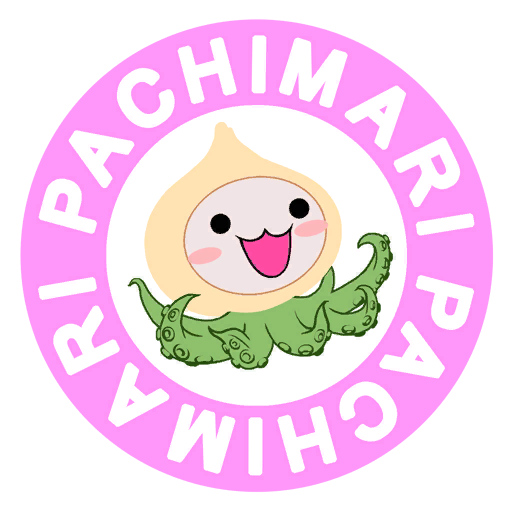
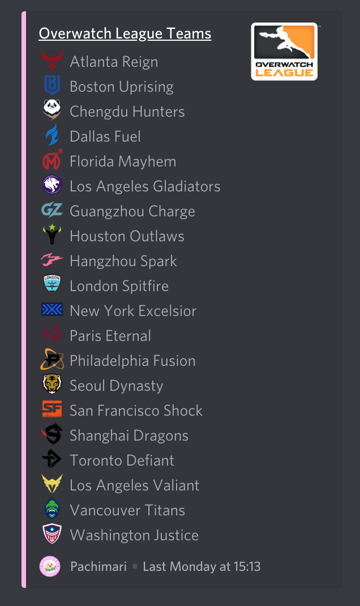
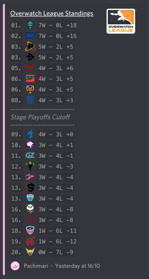

  

<h1 align=center>Pachimari</h1>

Discord bot for retrieving the latest in Overwatch League and Contenders news! Root for your favorite teams and players right from your Discord community! 🎮✨ 

## 2020 Update
The Overwatch League API which was once open to the public had shut down in 2019 in favor of the Stats Lab. I and several other developers tried to leverage the stats lab to no avail. It wasn't until some further complications that I had to shut the bot down. 

It has been a pleasure developing this bot. It's growth and influence was unexpected! If I can't run this bot anymore, I figured now's a perfect time to point and laugh at the spaghetti code behind Pachimari. Enjoy!

# Features 

## Teams
✨See all the teams competiting in current season of Overwatch League! 

> Command: `!teams [division]`

## Team

✨Get the latest info on your favorite teams!
> Command: `!team <teamname> [accounts|schedule]`

## Matches

✨See scores from previous matches and view upcoming matches for your favorite teams!
> Command: `!matches <teamname> [secondteamname]`

## Schedule

✨See when teams are facing off for each stage week!
> Command: `!schedule`

## Standings

✨See the latest Overwatch League standings!
> Command: `!standings`

## Live Matches

✨Follow real time match updates!
> Command: `!live [map|maps]`

## Players

✨See all of the players competing in Overwatch League!
> Command: `!players`

## Player

✨Get the latest info on your favorite players!
> Command: `!player <playername> [accounts]`

## Compare Players

✨Compare stats between two Overwatch League players!
> Command: `!compare <firstname> <secondname>`

## Disclaimer

Pachimari Bot isn’t endorsed or in any way affiliated with Blizzard Entertainment and doesn’t reflect the views or opinions of Blizzard Entertainment or anyone officially involved in producing or managing Overwatch. Overwatch, Pachimari, and Blizzard Entertainment are trademarks or registered trademarks of Blizzard Entertainment, Inc. in the U.S. and/or other countries. All submitted art content remains copyright of its original copyright holder.
